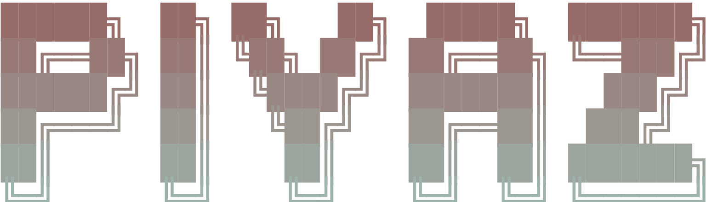

> The agentic workspace where people and AI coding agents work on the same project.

<p align="center">
  <a href="https://docs.piyaz.ai/docs/get-started/connect-your-editor/claude-code"></a>
  &nbsp;&nbsp;
  <a href="https://docs.piyaz.ai/docs/get-started/connect-your-editor/codex"></a>
  &nbsp;&nbsp;
  <a href="https://docs.piyaz.ai/docs/get-started/connect-your-editor/cursor"></a>
  &nbsp;&nbsp;
  <a href="https://docs.piyaz.ai/docs/get-started/connect-your-editor/antigravity"></a>
</p>

<p align="center">
  
</p>

Piyaz is an agentic workspace for building software. People and AI agents work the same project across harnesses, and Piyaz holds that work to the engineering process a real codebase needs, from decomposing an idea to reviewing the code before it merges.

Because everyone meets on the same project, several agents can build at the same time, each in its own harness and with no API keys to wire up, while engineers steer through their own agents. One agent implements a task while you refine another or add a new feature.

That project is one shared graph of tasks and their dependencies. Drop in an idea or an existing codebase and Piyaz breaks it into small, concrete tasks. When an agent picks one up, it already has the plan, the standards, and the decisions behind the work. Nothing starts from a cold read.

Full setup, guides, and reference live at **[docs.piyaz.ai](https://docs.piyaz.ai)**.

---

## Hosted (closed beta)

Piyaz is in a closed beta, and new accounts open in batches. Join the waitlist at **[app.piyaz.ai/sign-up](https://app.piyaz.ai/sign-up)**.

Once you're in, install the plugin for your agent (Claude Code, Codex, Cursor, or Antigravity) and sign in once at the user level. It then works in every project you open, no clone required. Per-agent setup is in the **[docs](https://docs.piyaz.ai)**.

## Self-host

Self-hosting is free under AGPL-3.0. You run the Piyaz server yourself and point the plugin's `piyaz-local` server at it. You need [Bun](https://bun.sh) and [Docker](https://docs.docker.com/get-docker/) for PostgreSQL. Full setup and upgrade steps are in the [self-host guide](https://docs.piyaz.ai/docs/self-hosting/run-locally).

---

## What it changes for you

**Stop re-briefing your agents.** Every task carries its own context: the plan, the decisions behind it, and how it connects to the rest of the project. Your next session picks up where the last one left off instead of asking you to explain the project again.

**Ship a big project without the quality falling off.** Piyaz breaks large work into small tasks with clear dependencies and hands each one exactly the context it needs, so the tenth task lands as cleanly as the first.

**Put more than one agent on the same project.** People and agents across Claude Code, Codex, Cursor, and Antigravity share one view of what's done, what's ready, and what's blocked, so their work doesn't collide or drift.

**Start from an idea or from code you already have.** Describe something new and Piyaz plans it out, or point it at an existing codebase and it maps the work you've already shipped into a tracked project.

**Talk, don't configure.** You say what you want in plain language. Piyaz plans the work, tracks it, and keeps the record current. No tool wrangling, no "here's what you need to know" prompts.

On Claude Code, **Composer** can take a task the whole way on its own: it researches the task against your codebase, writes the plan, implements it, opens a pull request, reviews it and fixes what review flags, then moves to the next ready task. You decide what merges.

---

## How it works

Piyaz keeps a live map of your project, the context network: every task, the dependencies between them, and the decisions behind each one. You work in plain language from your agent, and Piyaz keeps that map current as the work moves. Here is the loop.

**Plan a project.** Describe an idea and Piyaz brainstorms it into a brief, then decomposes it into a task graph with dependencies, asking one focused question at a time and pushing back on weak choices.

```text
/piyaz I want a cli that generates changelogs from conventional commits, with monorepo support
```

**Pick up the right work.** Ask what is next and Piyaz names the top ready task on the critical path. It claims the task, pulls the context it needs, and records what it built when it is done, so the next session starts from ground truth instead of a cold read.

```text
what should I work on next?
```

**Review before it merges.** An agent's work stops at `in_review`, never `done`. A review agent reads the diff and returns a verdict across security, performance, reliability, observability, and codebase standards, with a file and line for every finding. You approve or send it back. This is the gate that keeps low-quality code from landing.

```text
review MET-1. File-cited, do not rubber-stamp. Read the diff first.
```

**Or hand over the whole loop (Claude Code).** Composer takes a task from research to an open PR on its own: research, plan, implement, review, and a bounded fix loop, then it picks up the next ready task. You decide what merges.

```text
/piyaz:composer
```

We build Piyaz using Piyaz, so everything here is something we run day to day.

For the full detail, see the docs:

- [Plan a project](https://docs.piyaz.ai/docs/using-piyaz/plan-a-project) and [decompose into tasks](https://docs.piyaz.ai/docs/using-piyaz/decompose-into-tasks)
- [Track execution](https://docs.piyaz.ai/docs/using-piyaz/track-execution)
- [Review before merge](https://docs.piyaz.ai/docs/using-piyaz/review)
- [The composer pipeline](https://docs.piyaz.ai/docs/using-piyaz/composer)
- [End-to-end walkthrough](https://docs.piyaz.ai/docs/using-piyaz/walkthrough)

---

## Stack

Next.js 16, TypeScript 6, React 19, PostgreSQL, Drizzle ORM, Better-Auth, Tailwind CSS v4, Motion

---

## Stargazers

<a href="https://www.star-history.com/?repos=FrkAk%2Fpiyaz&type=date&legend=top-left">
 <picture>
   <source media="(prefers-color-scheme: dark)" srcset="https://api.star-history.com/chart?repos=FrkAk/piyaz&type=date&theme=dark&legend=top-left" />
   <source media="(prefers-color-scheme: light)" srcset="https://api.star-history.com/chart?repos=FrkAk/piyaz&type=date&legend=top-left" />
   
 </picture>
</a>

---

## Contributing

See [CONTRIBUTING.md](CONTRIBUTING.md) for setup instructions and PR guidelines.

## License

Piyaz is licensed under [AGPL-3.0](LICENSE). A commercial license is also available, see [LICENSING.md](LICENSING.md) for details.
