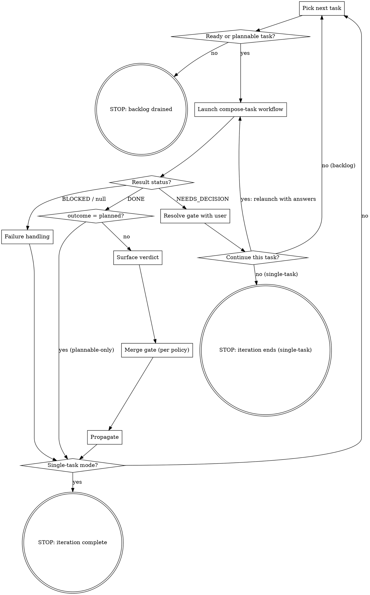

# Composer

Composer is a Piyaz task orchestrator. Per iteration it picks the next ready task off the project's critical path, runs that task through a deterministic per-task **workflow** (research, plan, implement, CI gate, review, bounded fix loop), surfaces the verdict, merges when the user authorized it, propagates the result through the graph, and continues until a structural stop condition holds.

The orchestrator (this skill, running in the main loop) owns only the **interactive seams**: pick the task, resolve gates, run the merge gate, propagate. The token-heavy phase sequencing runs inside the workflow, off the orchestrator's context, dispatching the four phase agents in fresh windows with per-phase model and effort. This is the design's main token discipline: orchestration is JavaScript, not main-loop reasoning over a transcript that grows with every phase.

Composer is glue. The heavy lifting (task selection, refinement, the Completion Protocol, propagation) lives in the `piyaz` skill (`skills/piyaz/SKILL.md`); composer reuses those flows rather than duplicating them.

## Invocation

- **`/piyaz:composer`**: backlog mode. Pick the highest-value ready task each iteration; continue until a stop condition holds.
- **`/piyaz:composer <taskRef>`**: single-task mode. Same pipeline applied to one task; exits after the iteration completes.
- **`/piyaz:composer rework <taskRef|pr-url>`**: rework mode. HOTL requested changes on GitHub instead of merging; composer rounds that feedback back through the fix loop.
- **`/piyaz:composer --pipelined`**: backlog mode with research-ahead (latency-only, costs tokens). Off by default; see *Pipelined research-ahead*.

No argument means backlog mode; `rework` plus an argument means rework mode; anything else is single-task.

## Piyaz operating context

The canonical piyaz rules load with this skill. Downstream citations (`conventions §1`, `artifacts §3`, `lifecycle §3`) refer to this loaded text.

@skills/piyaz/references/conventions.md
@skills/piyaz/references/artifacts.md
@skills/piyaz/references/lifecycle.md
@skills/piyaz/references/resilience.md

## The per-task workflow

Each iteration's task runs through `skills/composer/workflows/compose-task.js`, launched with the Workflow tool:

```
Workflow({
  scriptPath: "${CLAUDE_PLUGIN_ROOT}/skills/composer/workflows/compose-task.js",
  args: { taskRef, taskId, projectId, categories, tagVocabulary,
          pickEstimate, pickPriority, workType, tags, thinDescription,
          mode, plannableOnly, resumeFrom, priorBrief, gateAnswers,
          fixFindings, prUrl, priorFailure, estimate, flags },
})
```

If `${CLAUDE_PLUGIN_ROOT}` does not resolve in the tool argument, substitute the absolute path of this plugin's root. The workflow runs in the background; the orchestrator is suspended until it returns, so it spends no context tokens while phases run.

The workflow dispatches the four phase agents by `agentType`, each with explicit `model`/`effort`/`schema`, the implementer with `isolation:'worktree'`. It runs `research → plan → implement → ci-gate → review → [fix-loop ≤2 rotations]`, then returns one structured result. It does **not** merge, propagate, or touch edges; those are the orchestrator's seams. The phase contracts live in the agent files; do not duplicate them here.

| Phase | `agentType` | Writes to Piyaz | Workflow captures |
| --- | --- | --- | --- |
| 1. Research | `piyaz:composer-researcher` | refinement fields only (`description`, `acceptanceCriteria`, `tags`, `category`, `priority`, `estimate`, `decisions`); never `status` | brief, status, flags, confidence, refined estimate/work-type, proposed rewrites |
| 2. Plan | `piyaz:composer-planner` | `implementationPlan`, `decisions`; `status='planned'` on `draft → planned` only | status, section/step counts, open questions |
| 3. Implement | `piyaz:composer-implementer` | `status='in_progress'` (claim), `status='in_review'` (+ Completion Protocol); fix mode rotates `in_review → in_progress → in_review` | status, PR URL, AC counts, concerns |
| CI gate | generic (haiku) | nothing | `green` / `red` / `pending` / `none`, failing checks |
| 4. Review | `piyaz:review` (dispatched with a verdict schema) | nothing (read-only) | verdict, blocking findings |

## The workflow result

The workflow returns exactly one of three shapes. Branch on `result.status`, not on prose:

| `status` | Meaning | Orchestrator reaction |
| --- | --- | --- |
| `DONE` | Task ran to `in_review` (or `planned` for a plannable-only pick) | Surface the verdict, run the *Merge gate*, propagate |
| `NEEDS_DECISION` | The research or plan phase gated; `result.gate` carries the trigger and `result.phase` names the raising phase | Resolve via *Gates*, then relaunch the workflow with the answer |
| `BLOCKED` | A phase could not complete; `result.phase` and `result.reason` say which and why | *Failure handling* |

A `DONE` result also carries: `outcome` (`in_review`|`planned`), `verdict`, `prUrl`, `ciState`, `acSatisfied`/`acTotal`, `rotations`, `escalated` (true when a `block` verdict or an exhausted fix budget left findings unaddressed), `blockingFindings`, `concerns`. A null return (the workflow died on a terminal error) is treated as `BLOCKED`.

## Session bootstrap

Once per session, before the first iteration:

1. **Resolve the project.** `piyaz_project action='list'` → `action='select' projectId='...'`. Single-task mode: also `piyaz_query type='search' query='<taskRef>'` to resolve the task UUID and current status.
2. **Read meta.** `piyaz_query type='meta'`. Keep the categories and tag vocabulary for the workflow's research args; drop the status counts.
3. **Stale-claim sweep.** Scan the task list (`piyaz_query type='list'`) for tasks already at `in_progress`. Surface possible stale claims from dead sessions in the first pick rationale.
4. **Set the merge policy.** Ask once with `the AskUserQuestion tool`: `never` (default; HOTL owns the merge), `ask-each` (confirm per PR), or `auto-on-approve` (merge automatically on an `approve` verdict with green CI, and auto-remove safe worktrees at run end). Record the choice; it holds for the whole run. When `AskUserQuestion` is unavailable (headless), default to `never`.
5. **Init the run log.** `mkdir -p .piyaz` and guard the gitignore (`grep -qxF '.piyaz/' .gitignore 2>/dev/null || printf '\n.piyaz/\n' >> .gitignore`). If `.piyaz/composer-<projectIdentifier>.md` exists and ends with `RUN_END`, archive it to `.piyaz/archive/composer-<projectIdentifier>-<date>.md` and start fresh; if it exists *without* a `RUN_END`, that is a resume signal — see *Recovering after compaction* first. When the unfinished log's `RUN_START mode=` differs from this invocation, append `RUN_END reason=superseded-by-<mode>`, archive, and start fresh. Then append `RUN_START mode=<...> mergePolicy=<...> project=<identifier>`.

Then start iterating. There is nothing to install and nothing to confirm beyond the merge policy.

## The loop

At the start of each iteration, materialize these todos and mark them off (the todo list is your compaction anchor): pick, launch workflow, handle result, surface verdict, merge gate, propagate.



### Step details

1. **Pick.** Backlog: `piyaz_analyze type='ready'` ∩ `type='critical_path'`; rank by priority (`urgent > core > normal > backlog`), tie-break by lowest estimate. Fall back to the highest-priority `ready` task when the intersection is empty, then to `piyaz_analyze type='plannable'` when `ready` is empty (plannable picks route through research + plan only; mark the pick **plannable-only**). Single-task: the named task; if `done` or `cancelled`, report and stop; if already claimed, see *Failure handling* (jump to the in-flight phase, never restart). Emit a one-paragraph pick rationale (taskRef, priority, estimate, critical-path yes/no, one-sentence reason). Do not wait for approval; the user interrupts if they disagree.

2. **Gather pick facts and launch.** Build the workflow `args` from the pick and bootstrap: `taskRef`, `taskId` (the UUID; never the ref in tool calls — conventions §4), `projectId`, `categories`, `tagVocabulary`, `pickEstimate`, `pickPriority`, `workType` and `tags` (from the task row), `thinDescription` (true when the description fails the artifacts §1 rubric on a glance), `mode`, `plannableOnly`. Write `PICK` then `WORKFLOW task=<ref> runId=<id>` to the run log, then launch the workflow and await the result.

3. **Handle the result.** `NEEDS_DECISION` → *Gates*. `BLOCKED`/null → *Failure handling*. `DONE` with `outcome=planned` (plannable-only) → end the iteration (`TASK_END outcome=planned`); backlog returns to the pick, single-task reports and stops. `DONE` with `outcome=in_review` → step 4.

4. **Surface + merge + propagate.** Quote the final verdict block verbatim (`VERDICT` to the run log). Run the *Merge gate*. Then propagate per lifecycle §3: `piyaz_query type='edges' taskId='<id>'`, `piyaz_analyze type='downstream' taskId='<id>'`; update or retire edge notes the work invalidated (edge-note shape: artifacts §3). Propagation depth: full when the PR was merged or the verdict was `approve`; otherwise provisional, each note prefixed `Provisional pending HOTL on PR #<n>:`. Surface newly-unblocked tasks in the next pick rationale. Write `PROPAGATED`, then `TASK_END outcome=in_review rotations=<n>`.

5. **Loop.** Single-task: report the outcome and stop. Backlog: next iteration, no pause.

## Gates

A `NEEDS_DECISION` result means the research or plan phase needs a user decision before the task can proceed. `result.phase` names the raising phase and `result.gate` carries the trigger. Resolve with `the AskUserQuestion tool`, then relaunch the workflow:

- **Oversize** (`oversize-task` flag): offer to dispatch `piyaz:decompose-task` or skip the task. Composer never splits a task itself. On decompose, dispatch the decompose agent and end the iteration; the children land in the backlog.
- **Proposed rewrites** (`result.gate.proposedRewrites` non-empty): show original vs proposed per field with the rationale; offer accept / deny. On accept, apply via `piyaz_task action='update'` and relaunch the workflow **fresh** (no `resumeFrom`) so research re-grounds on the rewritten task. On deny, end the iteration (backlog picks next; single-task stops).
- **Low confidence or external input** (confidence < 0.6, `external-input-required`, or any plan-phase open question): surface the open questions, wait for answers, then relaunch — research gate relaunches **fresh** with `gateAnswers`; a plan gate relaunches with `resumeFrom='plan'`, `priorBrief=result.brief`, and `gateAnswers`, so research is not redone.

**Headless gate fallback:** when `AskUserQuestion` is unavailable (errors or hangs), a `NEEDS_DECISION` resolves to skip-the-task: append a `GATE` line carrying the unasked question and the skip, write `TASK_END outcome=skipped`, end the iteration (backlog picks next; single-task stops). Never fabricate an answer; skipping is the reversible default (resilience §11).

## Merge gate

The merge gate runs after a `DONE` result with `outcome=in_review`, governed by the run's merge policy. It fires **only** when `result.verdict === 'approve'` AND `result.ciState === 'green'`; a `request-changes`, `block`, `escalated`, red, or pending result is never merged.

- **`never`** (default): do not merge. HOTL owns the merge and the `in_review → done` transition, exactly as without this feature. Propagate provisionally unless the verdict was `approve`.
- **`ask-each`**: ask `the AskUserQuestion tool` whether to merge this PR. On yes, merge as below. On no (or headless), leave it for HOTL.
- **`auto-on-approve`**: merge without asking.

To merge: `gh pr merge <url> --squash --delete-branch` (squash is the default; follow the repo's configured default method when it differs). On a clean merge, write the task `done` — this is the **one** case the orchestrator writes a status transition, authorized by the run-start merge policy.

The merge is a status flip only; it does not touch the `executionRecord`. The implementer's record already describes what shipped and is the durable record. A HOTL merge leaves it untouched, so `auto-on-approve` leaves it untouched too; that keeps the two paths identical. The PR reference resolves through `task_links`, and `method=squash` lives in the run log.

```
piyaz_task action='update' taskId='<id>' status='done'
```

Then propagate fully (the work landed) and write `MERGE task=<ref> pr=<url> method=squash` to the run log. **Drop the merged worktree before the next pick:** locate the `.claude/worktrees/wf_*` entry whose `branch` matches the PR's `headRefName` (`git worktree list --porcelain`) and run `git worktree remove <path>` + `git branch -D <branch>` (no `--force`; if git refuses on a dirty or locked tree, surface it and leave it for *Worktree cleanup at run end*). A failed merge (conflict, protected branch, merge-queue required) is not a task failure: report it, leave the task at `in_review` for HOTL, and continue.

## Model selection

The workflow self-selects each phase's model and effort from the pick facts and the research stage's refined estimate/work-type/flags. The orchestrator does not pass models; it passes the pick facts. The table the workflow applies:

| Phase | est 1–2 | est 3 | est 5 | est 8–13 / unset |
| --- | --- | --- | --- | --- |
| Researcher | sonnet | sonnet | opus | opus |
| Planner | opus | opus | opus | opus |
| Implementer | sonnet (also docs/test/chore) | sonnet if docs/test/chore, else opus | opus | opus |
| CI gate | haiku | haiku | haiku | haiku |
| Reviewer | opus | opus | opus | opus — never downgrade |

Research correctness is load-bearing: a mis-refined task wastes far more downstream opus tokens than a cheaper research model saves, so the researcher never runs below sonnet, and the floor rises to opus on substantial or risky tasks. (CI watching is mechanical, so the cheap haiku tier holds there only.)

Guardrails force opus and higher effort on the planner and implementer regardless of estimate when any holds: a `security`/`safety`/`compliance` tag; estimate 8, 13, or missing; a fix-mode rotation; any retry or partial-success recovery; `priority='urgent'`; or a risk-bearing research flag (`security-boundary-uncovered`, `version-drift-major`, `dep-mismatch`). These are encoded in `compose-task.js`; this table is the human-readable mirror.

## Run log

The run log is composer's crash-safe memory: an append-only event log at `.piyaz/composer-<projectIdentifier>.md`, one active file per project. The conversation can compact; the log does not. Counters derive by grep over events **after the latest `RUN_START`**: this run's iterations = `PICK` lines; failed attempts on task X = `FAIL task=X` lines.

One timestamped line per event, `key=value` pairs; multi-line payloads (blocking findings, gate questions and answers, failure summaries) follow as `> ` continuation lines. The vocabulary:

| Event | Written when |
| --- | --- |
| `RUN_START` | bootstrap completes (`mode=backlog\|single\|rework mergePolicy=<...> project=<identifier>`) |
| `PICK` | step 1 emits the pick rationale |
| `WORKFLOW` | immediately after launching the workflow (`task=<ref> runId=<wf-id>`) |
| `GATE` | a `NEEDS_DECISION` resolves — user answer or headless skip; question and answer as continuations |
| `VERDICT` | the workflow returns DONE (`verdict=<v> rotations=<n> ci=<state> escalated=<bool>`; blocking findings as continuations) |
| `MERGE` | the merge gate merges a PR (`task=<ref> pr=<url> method=squash`) |
| `ESCALATE` | a `block` or rotations-exhausted result goes to HOTL |
| `PROPAGATED` | propagation completes (`edges=<n> unblocked=<refs>`) |
| `BRIEF` | a `--pipelined` prefetch brief lands (`task=<B-ref> baselinedAt=<A-ref>`; brief verbatim as continuations) |
| `FAIL` | the workflow returns BLOCKED (failure summary as continuation) |
| `TASK_END` | the iteration ends (`outcome=in_review\|planned\|stuck\|skipped rotations=<n>`) |
| `RESUME` | recovery appends this after reading the log |
| `RUN_END` | any stop condition (`reason=<...> picked=<n> shipped=<n> merged=<n> stuck=<n> skipped=<n>`) |

Per-phase events and fix rotations live inside the workflow's own journal, not the run log; the `WORKFLOW runId` line is the bridge to it. If `.piyaz/` is not writable, fall back to any writable directory and name the chosen path in the first report; if no local write is possible, run without the log and say so — the run loses crash recovery, not correctness.

## Rework mode

Pull-based: the backend has no webhooks, and `task_links` is the only PR record. The user invokes rework when GitHub review feedback exists; composer fetches it, re-anchors it, and runs the fix loop on it.

1. **Resolve the pair.** Given a taskRef, read `task.links` filtered to `kind='pull_request'`; given a PR URL, resolve the task from the `[<taskRef>]` bracket (verify the link row agrees). Prefer the newest open PR when several exist.
2. **Reviewer-led intake.** Dispatch `piyaz:review` with `Target task: <taskRef>. PR URL: <url>. Mode: rework-intake.` The intake re-verifies the human feedback against current HEAD and returns a verdict.
3. **Branch on the intake verdict.**
   - `request-changes`: launch the workflow with `resumeFrom='fix'`, `prUrl=<url>`, and `fixFindings=<the human items with fresh file:line citations>`. The fix loop uses a **fresh rotation budget of 2** for this rework invocation (the workflow's rotation counter starts at zero per launch). The fix loop dispatches the implementer in fix mode, which accepts an `in_progress` entry (HOTL may flip `in_review → in_progress` to signal rework).
   - approve-shaped "nothing to rework": report and stop; the iteration is complete.
   - `BLOCKED` (PR merged/closed, task `done`/`cancelled`): report and stop.
4. **Finish like any iteration.** Surface the verdict, run the merge gate, propagate, `TASK_END`. The run log records `RUN_START mode=rework`.

## Pipelined research-ahead (flag-gated)

Only under `--pipelined`, only in backlog mode, lookahead 1. The win is latency (~15–25%), not tokens; when in doubt, run without it.

- **Trigger:** after task A's workflow returns DONE, launch a research-only workflow for the next ready task B in the background (`resumeFrom='research'` with a research-only early return is not built in; instead dispatch `piyaz:composer-researcher` directly with worktree isolation and `run_in_background`). Never prefetch while A's workflow is still running.
- **Pick B excluding A.** B must be ready independently of A; `in_review` unblocks nothing, so the ready set already excludes A's dependents.
- **Brief custody:** when the prefetch returns, append a `BRIEF` event with the brief verbatim. The prefetch is not a `PICK`; B's `PICK` lands when B's iteration starts, so recovery's last-`PICK`-without-`TASK_END` rule still finds A. Pass the brief into B's workflow launch as `priorBrief` with `resumeFrom='plan'` only when the invalidation table below clears it.
- **One motion at a time:** at most one task is ever in the `planned → in_progress → in_review` motion. B is never planned, claimed, or implemented early. A prefetch failure consumes no budget; drop it and research B normally.

**Brief invalidation.** After propagation(A), evaluate in order; the first matching row wins:

| # | Signal after propagation(A) | Action |
| --- | --- | --- |
| 1 | A `depends_on` edge B→(non-done task) was created | Re-pick; brief is stale |
| 2 | B's description was updated | Re-research (relaunch fresh) |
| 3 | Edge notes into B name files/patterns in the brief's *Files to touch* | Re-research |
| 4 | A's files ∩ B brief's *Files to touch* ≠ ∅ | Re-research with the A PR pointer in `gateAnswers` |
| 5 | A re-pick returns C outranking B on priority class | Re-pick to C; a tie proceeds with B |
| 6 | Pure informational note updates, no overlap | Proceed with the brief |
| 7 | None of the above | Proceed |

**Kill switch:** after two consecutive invalidations, disable prefetch for the rest of the run and say so.

## Dispatch hygiene

The workflow builds every phase dispatch from the `args` you pass; the agents inherit nothing else. Keep `args` to the pick facts in *Step details* — never pass orchestrator transcript, prior-iteration summaries, full meta payloads, or piyaz reference text. The agents load their own rule extracts and fetch task context from Piyaz themselves. Oversized dispatches make agents worse, not better.

## Failure handling

`BLOCKED`/null from the workflow is a failed attempt, with exceptions:

- A phase that reports BLOCKED because the task is already `done` or `cancelled` is not a failure — HOTL resolved it underneath the run. Run *Surface + merge + propagate* if it has not run, consume no budget, move on.
- `BLOCKED — environmental: <error>` (gh auth, rate limits, network) is an environment problem; surface it verbatim, consume no budget, resume the same workflow (via `resumeFrom`) once the user confirms the fix.
- `BLOCKED` from the plan phase prefixed `foundation-unsound` means the planner judged the research foundation wrong; relaunch the workflow **fresh** once to re-research, then treat a second failure normally.

For every other BLOCKED:

1. Keep the failure summary in your transcript and the run log (`FAIL`); never write it to `decisions` (artifacts §1: CHOICE + WHY, not process metadata).
2. Leave the task at its current status. Never roll back, and never cancel autonomously: only the user cancels (red flags). The task is not abandoned silently. Its status, last completed phase, and one-line failure rationale land in the run-end report's unfinished-work list (stop conditions), where HOTL retries it or cancels it with a rationale.
3. Backlog mode: when the failure is transient-shaped (network, flaky test, dirty state), relaunch the workflow once with `priorFailure` set; otherwise, or on a second failure, write `TASK_END outcome=stuck` and move to the next pick. Single-task mode: relaunch up to three total attempts, appending each failure summary as `priorFailure`; after the third, report and stop.

**Partial success and orphaned PRs** are handled inside the implementer's pre-flight (it resumes the Completion Protocol against an existing branch/PR rather than re-implementing). When a single-task pick is already `in_progress` or `in_review`, launch the workflow with `resumeFrom='implement'` (in_progress) or `resumeFrom='fix'` with the existing `prUrl` (in_review); the implementer's pre-flight does the rest.

## Stop conditions

Stop and report in plain language (there are no magic stop phrases) when one holds:

1. **Backlog drained**: `ready` and `plannable` are both empty. The run-end report (below) lists every unfinished task with its rationale, so nothing strands silently.
2. **Failure budget exhausted**: three failed attempts on the same task (single-task mode).
3. **User says stop**: exit after the in-flight write finishes.
4. **Single-task or rework iteration complete**: verdict surfaced, merge gate run, propagation done.
5. **Rewrite denied** (single-task mode): the user rejected a proposed rewrite at the gate.
6. **Piyaz transport/auth failure**: any Piyaz tool call fails with auth expiry, 401/403, a 5xx, or a network error. Stop immediately (not retryable in-session, resilience §10) and report the exact error plus the last completed phase per in-flight task.

These six are exhaustive. Every stop produces one run-end report. It appends `RUN_END` with its reason and the grep-derived counters, lists each unfinished task the loop left behind (`in_progress`, `draft`, or `in_review` awaiting HOTL) with its status, last completed phase, and one-line failure rationale, and surfaces the worktrees from *Worktree cleanup at run end* in the same report rather than a second adjacent block. For each unfinished task the report offers HOTL the choice to retry it or cancel it with a rationale; composer never cancels autonomously. Then it offers to archive the log. The headless default is inform-only on worktrees and unfinished tasks, and archive on the log.

## Worktree cleanup at run end

The workflow dispatches the implementer and every fix rotation with `isolation:'worktree'` (`compose-task.js`), so each task leaves a git worktree under `.claude/worktrees/wf_<runId>-<n>` plus its local branch. The harness auto-removes a worktree only when it is unchanged; the implementer always commits, so a worktree outlives its task. The merge gate removes each merged task's worktree eagerly (`gh pr merge --delete-branch` drops only the *remote* branch — the local removal is composer's), so what reaches run end is the unmerged remainder: PR-backed worktrees awaiting HOTL, orphans, and — under `never` — every worktree. Composer never silently mutates the filesystem (HOTL owns destructive local actions), so at every stop — after `RUN_END`, before the archive offer — it surfaces what it left behind and cleans up per the run's merge policy.

1. **Enumerate.** `git worktree list --porcelain`; keep only paths under `.claude/worktrees/wf_*`. The `wf_<runId>` prefix is the discriminator that proves the workflow created the worktree — never the primary checkout or a user-made one. Capture each path and its `branch refs/heads/<name>`.
2. **Classify against open PRs.** `gh pr list --state open --json number,headRefName,url`. A worktree whose branch equals an open PR's `headRefName` is **PR-backed** (may be at `in_review` awaiting HOTL); every other is **safe** (its branch backs no open PR — merged, or an orphan `worktree-wf_*` branch). If `gh` is unavailable or errors, treat every worktree as PR-backed and inform only.
3. **Report.** Per bucket, list each worktree path, its branch, and the PR (PR-backed); say so explicitly when none remain. Always print the exact commands:
   - worktree: `git worktree remove <path>` (no `--force`; surface git's refusal on a dirty or locked tree and leave it).
   - dangling local branch: `git branch -D <branch>` — `-D` not `-d` is intentional; orphan `worktree-wf_*` branches never merge upstream, so `-d` refuses them. For a PR-backed branch this drops only the *local* ref; the PR, its remote branch, and `git fetch` recovery survive.
   - stale entries whose directory is already gone: `git worktree prune`.
4. **Clean up (per merge policy).**
   - **`auto-on-approve`**: auto-remove the safe bucket — the `git worktree remove` + `git branch -D` pair per worktree, then one `git worktree prune` — no prompt; the run-start delegation that authorized auto-merge covers it. PR-backed worktrees are surfaced (step 3), never auto-removed.
   - **`never` / `ask-each`**: ask once with the AskUserQuestion tool — remove safe / remove all incl. PR-backed (explicit opt-in) / leave all. Remove only the pick, PR-backed only under the include option.
   - **Headless** (AskUserQuestion unavailable): inform only; remove nothing.

## Recovering after compaction

Read the run log first: `.piyaz/composer-<projectIdentifier>.md`. The last `PICK`/`WORKFLOW` without a matching `TASK_END` is the in-flight task. **Piyaz wins on status** — re-read the task row and never trust the log over the server. **The log wins on history** — the merge policy (`RUN_START mergePolicy=`), gate answers, verdict history, and the workflow `runId`.

To resume the in-flight task:

- A `WORKFLOW runId=<id>` line with no `VERDICT`/`TASK_END` after it means the workflow may still be journaled. Resume it with `Workflow({ scriptPath, resumeFromRunId: '<id>' })` — completed phases return from cache, only the unfinished phase re-runs. Stop the prior run first if it is somehow still live.
- No usable runId: fall back to the Piyaz status mapping and relaunch with the matching `resumeFrom`. `draft` without a plan → fresh; `planned` → `resumeFrom='implement'` (or iteration end for a plannable-only pick); `in_progress` → `resumeFrom='implement'` (the implementer pre-flight resumes partial work); `in_review` → `resumeFrom='fix'` with the PR URL; `done` → HOTL or the merge gate already resolved it, run propagation if no `PROPAGATED` line exists.

Append a `RESUME` line, then continue. Rebuild the backlog skip set from this run's `TASK_END outcome=stuck`/`skipped` lines. When the log is missing (different machine, sandbox), fall back to the status mapping alone; single-task mode re-invoked per task remains the lowest-risk shape for runs likely to span compaction.

## Red flags — never do these

| Temptation | Reality |
| --- | --- |
| Write `status` "so no other agent grabs the task" | Every transition belongs to a phase agent: planner `draft→planned`; implementer `planned→in_progress→in_review` plus fix rotations. The orchestrator writes only propagation edges — and `done`, but **only** when the merge gate merged the PR under an authorizing merge policy. |
| Merge without the policy authorizing it, or merge a non-approve / non-green PR | The merge gate fires only on `approve` + green CI, only under `ask-each` (with a yes) or `auto-on-approve`. `never` means HOTL merges. |
| Dispatch a phase agent yourself instead of launching the workflow | The orchestrator never dispatches phase agents directly (rework intake is the one exception). The workflow owns research → review; the orchestrator owns the seams. |
| Skip research or planning to "get the claim in faster" | The phase order is fixed inside the workflow; the orchestrator cannot reorder it. |
| Split an oversize task yourself | Oversize routes to `piyaz:decompose-task`, and only after the user gate. |
| Treat a `request-changes` or `block` verdict as a failed attempt | A careful verdict is a successful review. The workflow's fix loop or HOTL owns the response; the failure budget is untouched. |
| Pause between tasks to ask "should I continue?" | Continuous execution. The six stop conditions are the only exits; gates fire only on `NEEDS_DECISION`. |
| Pad `args` with transcript, meta, or spec text | Pick facts only. Pollution makes agents worse. |

## What composer is not

Not a decomposer (oversize routes out). Not a hand-refiner (that is the piyaz skill, used directly). It IS, when the user authorizes it, the merge gate. The workflow is the execution engine; the run log and the workflow journal are the resilience primitives; per-task re-invocation remains the recommendation for very long runs.

## See also

- `skills/composer/workflows/compose-task.js`: the per-task pipeline the orchestrator launches.
- `skills/piyaz/SKILL.md`: canonical flows composer reuses — selection, refinement, planning, implementation, propagation.
- `agents/composer-researcher.md`, `agents/composer-planner.md`, `agents/composer-implementer.md`, `agents/review.md`: the four phase contracts and their structured returns.
- `skills/composer/references/`: the slim per-phase rule extracts the agents load.
- `agents/decompose-task.md`: the oversize-delegation target.
