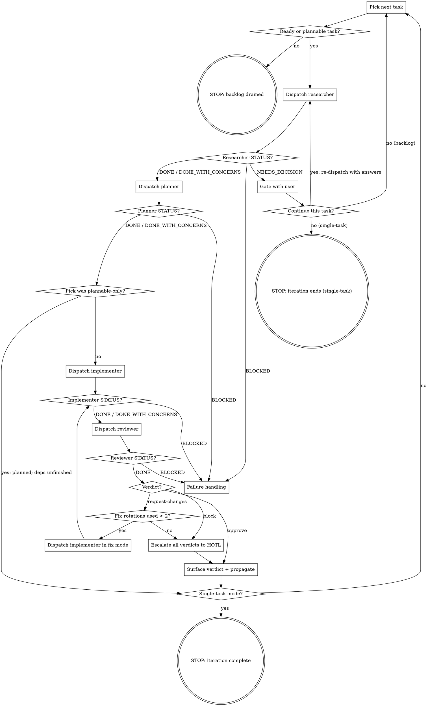

# Composer

Composer is a Mymir task orchestrator. Per iteration it picks the next ready task off the project's critical path, dispatches four phase subagents in sequence (research, plan, implement, review), runs a bounded review→fix loop, propagates the result through the graph, and continues until a structural stop condition holds. Each subagent runs in a fresh context with a focused tool set; the orchestrator stays clean and writes nothing to tasks except propagation edges.

Composer is glue. The heavy lifting (task selection, refinement, the Completion Protocol, propagation) lives in the `mymir` skill (`plugins/claude-code/skills/mymir/SKILL.md`); composer reuses those flows rather than duplicating them.

## Invocation

- **`/mymir:composer`**: backlog mode. Pick the highest-value ready task each iteration; continue until a stop condition holds.
- **`/mymir:composer <taskRef>`**: single-task mode. Same pipeline applied to one task; exits after the iteration completes.

No argument means backlog mode; anything else is single-task.

## Mymir operating context

The canonical mymir rules load with this skill. Downstream citations (`conventions §1`, `artifacts §3`, `lifecycle §3`) refer to this loaded text.

@skills/mymir/references/conventions.md
@skills/mymir/references/artifacts.md
@skills/mymir/references/lifecycle.md
@skills/mymir/references/resilience.md

## The four phase subagents

Each is a registered plugin agent dispatched via the Task tool by `subagent_type`. Their contracts live in their own files; do not duplicate their logic here.

| Phase | `subagent_type` | Writes to Mymir | Returns |
| --- | --- | --- | --- |
| 1. Research | `mymir:composer-researcher` | Refinement fields only (`description`, `acceptanceCriteria`, `tags`, `category`, `priority`, `estimate`, `decisions`); never `status` | Research brief + `STATUS` line |
| 2. Plan | `mymir:composer-planner` | `implementationPlan`, `decisions`; `status='planned'` on the `draft → planned` transition only | One-sentence confirmation + `STATUS` line |
| 3. Implement | `mymir:composer-implementer` | `status='in_progress'` (claim), `status='in_review'` (+ full Completion Protocol payload); in fix mode rotates `in_review → in_progress → in_review` | PR URL + one-line summary + `STATUS` line |
| 4. Review | `mymir:review` | Nothing (read-only over Mymir) | Structured verdict + `STATUS` line |

The task row is the single source of truth. The researcher refines it before planning; the planner saves the plan to it; the implementer reads everything (refined description, ACs, plan, upstream decisions) from `mymir_context depth='agent'`; the reviewer reads `mymir_context depth='review'`. Dispatch payloads stay minimal (see *Dispatch hygiene*).

## Status vocabulary

Every subagent return ends with `STATUS: <value> — <one-line reason>`. Branch on the status, not on your reading of the prose:

| STATUS | Meaning | Orchestrator reaction |
| --- | --- | --- |
| `DONE` | Phase output complete | Advance to the next phase |
| `DONE_WITH_CONCERNS` | Complete, but the agent flagged doubts | Quote the concerns in the iteration log, then advance |
| `NEEDS_DECISION` | A user decision is required | Gate via `AskUserQuestion`; act on the answer |
| `BLOCKED` | Phase cannot complete | *Failure handling* |

Expected `NEEDS_DECISION` triggers (all from the researcher):

- **Oversize** (`oversize-task` flag): offer to dispatch `mymir:decompose-task` or skip the task. Composer never splits a task itself.
- **Proposed rewrites** (`## Proposed rewrites` non-empty): show original vs proposed per field with the researcher's rationale; offer accept / deny. On accept, apply via `mymir_task action='update'` and re-dispatch the researcher on the rewritten task (the old brief is invalid). On deny, end the iteration: backlog mode picks the next task; single-task mode stops.
- **Low confidence or external input** (confidence < 0.6, `external-input-required`): surface the open questions, wait for answers, re-dispatch with the answers appended.

A return without a STATUS line is malformed: re-read the prose once; if the outcome is still ambiguous, treat it as `BLOCKED`.

**Headless gate fallback:** when `AskUserQuestion` is unavailable (errors or hangs — headless runs, policy-denied contexts), a `NEEDS_DECISION` gate resolves to skip-the-task: record the unasked question and the skip in the stop report, then end the iteration (backlog mode picks the next task; single-task mode stops). Never fabricate an answer — skipping is the reversible default (resilience §11).

## Session bootstrap

Once per session, before the first iteration:

1. **Resolve the project.** `mymir_project action='list'` → `action='select' projectId='...'`. Single-task mode: also `mymir_query type='search' query='<taskRef>'` to resolve the task UUID and current status.
2. **Read meta.** `mymir_query type='meta'`. Keep the categories and tag vocabulary for researcher dispatches; drop the status counts.
3. **Stale-claim sweep.** Scan the project's task list (`mymir_query type='list'`) for tasks already at `in_progress`. These are possible stale claims from dead sessions; surface them in the first pick rationale so the user sees them before the run commits elsewhere.

Then start iterating. There is nothing to install and nothing to confirm.

## The loop

At the start of each iteration, materialize these steps as todos and mark them off as you go (the todo list is your compaction anchor): pick, research, plan, implement, review, surface verdict, propagate.



### Step details

1. **Pick.** Backlog: `mymir_analyze type='ready'` ∩ `type='critical_path'`; rank by priority (`urgent > core > normal > backlog`), tie-break by lowest estimate. Fall back to the highest-priority `ready` task when the intersection is empty, then to `mymir_analyze type='plannable'` when `ready` is empty (those route through research + plan only; their dependencies are unfinished, so there is nothing to implement yet — note the pick as **plannable-only**). Single-task: the named task; if already `done` or `cancelled`, report that and stop. If the named task is already claimed, never re-run research or planning on it: at `in_progress`, jump straight to implement-phase recovery (the partial-success check in *Failure handling*); at `in_review`, jump straight to *Review and the fix loop*. Emit a one-paragraph pick rationale (taskRef, priority, estimate, critical-path yes/no, one-sentence reason). Do not wait for approval — the user interrupts if they disagree.

2. **Research.** Dispatch `mymir:composer-researcher` with: `Target task: <taskRef>`, the categories + tag vocabulary from bootstrap, and (on re-dispatch) the user's gate answers. Status does not change in this phase; the researcher refines the task row in place. React per *Status vocabulary*.

3. **Plan.** Dispatch `mymir:composer-planner` with: `Target task: <taskRef>`, the task's current status (so it knows new-plan vs re-validate), and the research brief verbatim. Verify with one `mymir_context depth='summary' taskId='<id>'` poll: a `draft` entry must now show a plan and `status='planned'`. If not, re-dispatch once with the failure appended; a second miss is `BLOCKED`.

   When the pick was plannable-only, the iteration ends here: the task is now `planned` and its dependencies are still unfinished, so there is nothing to implement. Backlog mode returns to the pick; single-task mode reports the planned outcome and stops. Never dispatch the implementer on a plannable-only pick.

4. **Implement.** Dispatch `mymir:composer-implementer` with: `Target task: <taskRef>. Plan is saved to Mymir; fetch via mymir_context depth='agent'. Claim the task (planned → in_progress), implement per the implementationPlan, open a PR, mark in_review per the Completion Protocol.` Append the prior failure summary on retries.

5. **Review and the fix loop.** Dispatch `mymir:review` with: `Target task: <taskRef>. PR URL: <url>. Mode: composer-phase-4. Fetch the bundle via mymir_context depth='review'.` On `STATUS: DONE`, branch on the verdict payload:
   - **`approve`**: go to step 6.
   - **`request-changes`**, fewer than 2 fix rotations used this task: dispatch the implementer in fix mode — `Target task: <taskRef>. Fix mode. PR: <url>. Address exactly these review findings, re-run verification, re-mark in_review:` followed by the verdict's blocking findings verbatim. On the implementer's `DONE`, re-dispatch the reviewer (same dispatch shape). Each fix dispatch + re-review is one rotation.
   - **`request-changes`** with 2 rotations used, or **`block`**: stop fixing. Escalate every verdict from this task to HOTL and go to step 6. `block` is never auto-fixed; review.md calibrates it as "one rotation will not land this".
   - The verdict is advisory beyond the fix loop: HOTL owns `in_review → done` on GitHub regardless of verdict.

6. **Surface + propagate.** Quote the final verdict block verbatim. Then propagate per lifecycle §3: `mymir_query type='edges' taskId='<id>'`, `mymir_analyze type='downstream' taskId='<id>'`; update or retire edge notes the work invalidated (edge-note shape: artifacts §3 — one to three short sentences addressed to the downstream task's agent). Propagation depth follows the verdict: on `approve`, propagate fully. On an escalated `request-changes` or `block`, write edge-note updates as provisional — prefix each with `Provisional pending HOTL on PR #<n>:` — because HOTL may reject the work; the HOTL `done` flip (outside composer, as today) is the trigger for firming them up. Surface newly-unblocked tasks in the next pick rationale.

7. **Loop.** Single-task: report the iteration outcome and stop. Backlog: next iteration, no pause.

## Dispatch hygiene

Subagents inherit nothing from this session; the dispatch prompt is their whole world beyond their own agent file and tools. Keep every dispatch to the phase minimum shown in *Step details*. Never paste orchestrator transcript, prior-iteration summaries, full meta payloads, or mymir reference text into a dispatch — the agents load their own rules extract and fetch task context from Mymir themselves. Oversized dispatches make agents worse, not better.

## Failure handling

`BLOCKED` from any phase is a failed attempt, with one exception: a phase that reports BLOCKED because the task is already at `done` or `cancelled` is not a failure — HOTL resolved the task underneath the run (e.g. approving mid-fix-rotation). Treat that as iteration complete: run *Surface + propagate* if it has not run, consume no failure budget, and move on. For every other BLOCKED:

1. Keep the failure summary in your transcript. Do not write it to `decisions` — per artifacts §1 that field is CHOICE + WHY, not process metadata.
2. Leave the task at its current status. Never roll back, never cancel.
3. Backlog mode: when the failure summary is transient-shaped (network hiccup, flaky test, dirty workspace state), retry the failed phase once with the failure summary appended; otherwise, or when the retry also fails, move to the next pick; the stuck task stays where it is for human triage. Single-task mode: retry the failed phase up to three total attempts on the task, appending each failure summary to the re-dispatch; after the third, report and stop. Re-run research or planning only when the failure clearly traces to a planning gap (e.g. the plan names a file that does not exist).

**Partial success (PR exists, `in_review` not marked):** when a retry's pre-flight finds the task at `in_progress` with an open PR matching `<type>/<taskRef-lowercased>-<title-slug>`, do not re-implement. First verify the PR actually belongs to the task: its title or body must carry the `[<taskRef>]` bracket form — a branch-name match alone is not proof. Verified: dispatch the implementer to resume the Completion Protocol against the existing PR (re-evaluate ACs, populate the payload, mark `in_review`). Counts as one attempt.

**`in_review` without a PR link:** when the task sits at `in_review` but `task.links` carries no `pull_request` entry, look for the orphaned PR:

```bash
gh pr list --state open --json url,title,body,headRefName \
  --jq '.[] | select(.headRefName | contains("<taskRef-lowercased>"))'
```

If a hit carries the `[<taskRef>]` bracket form in title or body, dispatch the implementer to re-run the Completion Protocol payload against it (the `prUrl` write repairs the link). No verified match: report the inconsistency to the user; never fabricate a link.

## Stop conditions

Stop and report in plain language (there are no magic stop phrases) when one of these holds:

1. **Backlog drained**: `ready` and `plannable` are both empty. The stop report enumerates every task left at `in_progress`/`in_review` with its failure summary — the stranded-task report; nothing strands silently.
2. **Failure budget exhausted**: three failed attempts on the same task (single-task mode).
3. **User says stop**: exit after the in-flight write finishes.
4. **Single-task iteration complete**: verdict surfaced and propagation done. The task itself sits at `in_review` awaiting HOTL; composer's job is finished.
5. **Rewrite denied** (single-task mode): the user rejected a proposed rewrite at the gate.
6. **Mymir transport/auth failure**: any Mymir tool call fails with auth expiry, 401/403, a 5xx, or a network error. Stop immediately — these are not retryable in-session (resilience §10) — and report the exact error text plus the last completed phase for each in-flight task.

These six are exhaustive. Do not invent new stop conditions, and do not stop for anything else.

## Recovering after compaction

Re-derive the phase from the iteration todos plus the task's Mymir status: `draft` without a plan → research or planning pending; `planned` → implementation pending; `in_progress` → implementer in flight, a fix rotation in flight, or partial-success recovery; `in_review` → review pending, the fix loop mid-cycle, or the iteration's verdict already in the transcript (check before re-dispatching); `done` → HOTL approved, run propagation if it has not run. For runs likely to span compaction, prefer single-task mode re-invoked per task. Broader primitives: the resilience reference loaded above.

## Red flags — never do these

| Temptation | Reality |
| --- | --- |
| Write `status` "so no other agent grabs the task" | Every transition belongs to a subagent: planner `draft→planned`; implementer `planned→in_progress→in_review` plus the fix rotation; HOTL `in_review→done`. The orchestrator writes propagation edges, nothing else. |
| Skip research or planning to "get the claim in faster" | The phase order is fixed for every task, including `planned` entries (the planner re-validates): research → plan → implement → review. The implementer claims when its turn comes; no urgency moves it earlier. |
| Split an oversize task yourself | Oversize routes to `mymir:decompose-task`, and only after the user gate. |
| Treat `request-changes` or `block` as a failed attempt | A careful verdict is a successful review (`STATUS: DONE`). The fix loop or HOTL owns the response; the failure budget is untouched. |
| Re-implement when a matching PR already exists | Resume the Completion Protocol instead. |
| Pause between tasks to ask "should I continue?" | Continuous execution. The six stop conditions are the only exits; gates fire only on `NEEDS_DECISION`. |
| Keep fixing after 2 rotations, or auto-fix a `block` | Escalate to HOTL with all verdicts. |
| Pad a dispatch with transcript, meta, or spec text | Phase minimum only. Pollution makes agents worse. |
| Emit or watch for literal stop phrases | Stops are structural; report them in plain language. |

## What composer is not

Not a decomposer (oversize routes out). Not a hand-refiner (that is the mymir skill, used directly). Not the merge gate (HOTL owns `in_review → done` and merging, whatever the verdict). Not a session-resilience layer (re-invoke per task for very long runs).

## See also

- `plugins/claude-code/skills/mymir/SKILL.md`: canonical flows composer reuses — selection (§ *What should I work on?*), refinement (§ *Refine a task*), planning (§ *Plan a draft task*), implementation (§ *Implement a task*), propagation.
- `plugins/claude-code/agents/composer-researcher.md`, `composer-planner.md`, `composer-implementer.md`, `review.md`: the four phase contracts, including each phase's STATUS rules.
- `plugins/claude-code/skills/composer/references/`: the slim per-phase rule extracts the agents load.
- `plugins/claude-code/agents/decompose-task.md`: the oversize-delegation target.
