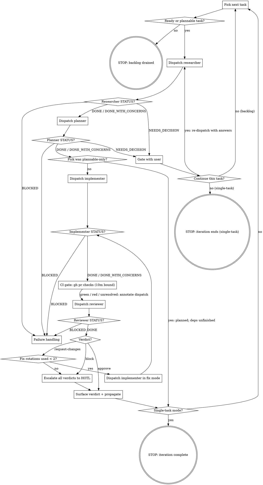

# Composer

Composer is a Mymir task orchestrator. Per iteration it picks the next ready task off the project's critical path, dispatches four phase subagents in sequence (research, plan, implement, review), runs a bounded review→fix loop, propagates the result through the graph, and continues until a structural stop condition holds. Each subagent runs in a fresh context with a focused tool set; the orchestrator stays clean and writes nothing to tasks except propagation edges.

Composer is glue. The heavy lifting (task selection, refinement, the Completion Protocol, propagation) lives in the `mymir` skill (`plugins/claude-code/skills/mymir/SKILL.md`); composer reuses those flows rather than duplicating them.

## Invocation

- **`/mymir:composer`**: backlog mode. Pick the highest-value ready task each iteration; continue until a stop condition holds.
- **`/mymir:composer <taskRef>`**: single-task mode. Same pipeline applied to one task; exits after the iteration completes.
- **`/mymir:composer rework <taskRef|pr-url>`**: rework mode. HOTL requested changes on GitHub instead of merging; composer rounds that feedback back through the fix loop.
- **`/mymir:composer --pipelined`**: backlog mode with research-ahead. While task A is in review/fix, the researcher for the next task B runs in the background. Lookahead is hard-capped at 1. Backlog mode only — the flag is ignored in single-task and rework modes.

No argument means backlog mode; `rework` plus an argument means rework mode; anything else is single-task.

## Mymir operating context

The canonical mymir rules load with this skill. Downstream citations (`conventions §1`, `artifacts §3`, `lifecycle §3`) refer to this loaded text.

@skills/mymir/references/conventions.md
@skills/mymir/references/artifacts.md
@skills/mymir/references/lifecycle.md
@skills/mymir/references/resilience.md

## The four phase subagents

Each is a registered plugin agent dispatched via the Task tool by `subagent_type`. Their contracts live in their own files; do not duplicate their logic here.

| Phase | `subagent_type` | Writes to Mymir | Returns |
| --- | --- | --- | --- |
| 1. Research | `mymir:composer-researcher` | Refinement fields only (`description`, `acceptanceCriteria`, `tags`, `category`, `priority`, `estimate`, `decisions`); never `status` | Research brief + `STATUS` line |
| 2. Plan | `mymir:composer-planner` | `implementationPlan`, `decisions`; `status='planned'` on the `draft → planned` transition only | One-sentence confirmation + `STATUS` line |
| 3. Implement | `mymir:composer-implementer` | `status='in_progress'` (claim), `status='in_review'` (+ full Completion Protocol payload); in fix mode rotates `in_review → in_progress → in_review` | PR URL + one-line summary + `STATUS` line |
| 4. Review | `mymir:review` | Nothing (read-only over Mymir) | Structured verdict + `STATUS` line |

The task row is the single source of truth. The researcher refines it before planning; the planner saves the plan to it; the implementer reads everything (refined description, ACs, plan, upstream decisions) from `mymir_context depth='agent'`; the reviewer reads `mymir_context depth='review'`. Dispatch payloads stay minimal (see *Dispatch hygiene*).

## Status vocabulary

Every subagent return ends with `STATUS: <value> — <one-line reason>`. Branch on the status, not on your reading of the prose:

| STATUS | Meaning | Orchestrator reaction |
| --- | --- | --- |
| `DONE` | Phase output complete | Advance to the next phase |
| `DONE_WITH_CONCERNS` | Complete, but the agent flagged doubts | Quote the concerns in the iteration log, then advance |
| `NEEDS_DECISION` | A user decision is required | Gate via `AskUserQuestion`; act on the answer |
| `BLOCKED` | Phase cannot complete | *Failure handling* |

Expected `NEEDS_DECISION` triggers (typically from the researcher; any phase may raise one — gate the same way and re-dispatch the **raising agent** with the answers):

- **Oversize** (`oversize-task` flag): offer to dispatch `mymir:decompose-task` or skip the task. Composer never splits a task itself.
- **Proposed rewrites** (`## Proposed rewrites` non-empty): show original vs proposed per field with the researcher's rationale; offer accept / deny. On accept, apply via `mymir_task action='update'` and re-dispatch the researcher on the rewritten task (the old brief is invalid). On deny, end the iteration: backlog mode picks the next task; single-task mode stops.
- **Low confidence or external input** (confidence < 0.6, `external-input-required`): surface the open questions, wait for answers, re-dispatch with the answers appended.

A return without a STATUS line is malformed: re-read the prose once; if the outcome is still ambiguous, treat it as `BLOCKED`.

**Headless gate fallback:** when `AskUserQuestion` is unavailable (errors or hangs — headless runs, policy-denied contexts), a `NEEDS_DECISION` gate resolves to skip-the-task: append a `GATE` line to the run log carrying the unasked question and the skip as continuations, then end the iteration (`TASK_END outcome=skipped`) (backlog mode picks the next task; single-task mode stops). Never fabricate an answer — skipping is the reversible default (resilience §11).

## Session bootstrap

Once per session, before the first iteration:

1. **Resolve the project.** `mymir_project action='list'` → `action='select' projectId='...'`. Single-task mode: also `mymir_query type='search' query='<taskRef>'` to resolve the task UUID and current status.
2. **Read meta.** `mymir_query type='meta'`. Keep the categories and tag vocabulary for researcher dispatches; drop the status counts.
3. **Stale-claim sweep.** Scan the project's task list (`mymir_query type='list'`) for tasks already at `in_progress`. These are possible stale claims from dead sessions; surface them in the first pick rationale so the user sees them before the run commits elsewhere.
4. **Init the run log.** `mkdir -p .mymir` and guard the gitignore (`grep -qxF '.mymir/' .gitignore 2>/dev/null || printf '\n.mymir/\n' >> .gitignore` — the resilience §3 pattern, with a leading newline so a `.gitignore` ending without one is not corrupted). If `.mymir/composer-<projectIdentifier>.md` already exists and ends with a `RUN_END` line, archive it to `.mymir/archive/composer-<projectIdentifier>-<date>.md` and start fresh; if it exists *without* a `RUN_END`, that is a resume signal — see *Recovering after compaction* before doing anything else. Exception: when the unfinished log's `RUN_START mode=` differs from this invocation (e.g. `rework` invoked over an interrupted backlog run), it is not a resume — append `RUN_END reason=superseded-by-<mode>`, archive it, and start fresh. Then append `RUN_START`.

Then start iterating. There is nothing to install and nothing to confirm.

## The loop

At the start of each iteration, materialize these steps as todos and mark them off as you go (the todo list is your compaction anchor): pick, research, plan, implement, ci gate, review, surface verdict, propagate.



### Step details

1. **Pick.** Backlog: `mymir_analyze type='ready'` ∩ `type='critical_path'`; rank by priority (`urgent > core > normal > backlog`), tie-break by lowest estimate. Fall back to the highest-priority `ready` task when the intersection is empty, then to `mymir_analyze type='plannable'` when `ready` is empty (those route through research + plan only; their dependencies are unfinished, so there is nothing to implement yet — note the pick as **plannable-only**). Single-task: the named task; if already `done` or `cancelled`, report that and stop. If the named task is already claimed, never re-run research or planning on it: at `in_progress`, jump straight to implement-phase recovery (the partial-success check in *Failure handling*); at `in_review`, jump straight to *Review and the fix loop*. Emit a one-paragraph pick rationale (taskRef, priority, estimate, critical-path yes/no, one-sentence reason). Do not wait for approval — the user interrupts if they disagree.

2. **Research.** Dispatch `mymir:composer-researcher` with: `Target task: <taskRef>`, the categories + tag vocabulary from bootstrap, and (on re-dispatch) the user's gate answers. Status does not change in this phase; the researcher refines the task row in place. React per *Status vocabulary*.

3. **Plan.** Dispatch `mymir:composer-planner` with: `Target task: <taskRef>`, the task's current status (so it knows new-plan vs re-validate), and the research brief verbatim. Verify with one `mymir_context depth='summary' taskId='<id>'` poll: a `draft` entry must now show a plan and `status='planned'`. If not, re-dispatch once with the failure appended; a second miss is `BLOCKED`.

   When the pick was plannable-only, the iteration ends here: the task is now `planned` and its dependencies are still unfinished, so there is nothing to implement. Backlog mode returns to the pick; single-task mode reports the planned outcome and stops. Never dispatch the implementer on a plannable-only pick.

4. **Implement.** First check the pick type: when the pick was plannable-only, do not enter this step — the iteration already ended at `planned` (step 3). Otherwise dispatch `mymir:composer-implementer` with: `Target task: <taskRef>. Plan is saved to Mymir; fetch via mymir_context depth='agent'. Claim the task (planned → in_progress), implement per the implementationPlan, open a PR, mark in_review per the Completion Protocol.` Append the prior failure summary on retries. The implementer runs worktree-isolated (frontmatter `isolation: worktree`; also pass the Task tool's `isolation: "worktree"` parameter at dispatch, which is verified to work with plugin agents): it works in its own tree, the orchestrator's tree never moves, and the researcher's baseline stays stable.

5. **CI gate.** After the implementer returns DONE with a PR URL, watch the checks with a bounded timeout and branch on the **exit code**, never on truncated output: `timeout 600 gh pr checks <url> --watch; rc=$?`. `rc=0` → green. `rc=124` (timeout killed the watch mid-pending) or `rc=8` (gh's checks-pending code) → still pending. Any other non-zero `rc` → red; read the failing check names from the output. Skip the gate entirely when the repo has no checks configured (`gh pr checks` reports no checks — that is a skip, not a red). Branch on the result:
   - **Green**: dispatch the reviewer normally.
   - **Red**: dispatch the reviewer with the failing check names appended to the dispatch (`CI: failing — <check names>`); the reviewer may not approve red CI.
   - **Still pending at the 10-minute timeout**: dispatch the reviewer with `CI: unresolved after 10m`; `approve` is off the table, and an otherwise-clean review returns `request-changes` citing unresolved CI as the sole blocking finding.

   The gate re-runs after every fix rotation's implementer DONE.

6. **Review and the fix loop.** Dispatch `mymir:review` with: `Target task: <taskRef>. PR URL: <url>. Mode: composer-phase-4. Fetch the bundle via mymir_context depth='review'.` On `STATUS: DONE`, branch on the verdict payload:
   - **`approve`**: go to step 7.
   - **`request-changes`**, fewer than 2 fix rotations used this task: dispatch the implementer in fix mode — `Target task: <taskRef>. Fix mode. PR: <url>. Address exactly these review findings, re-run verification, re-mark in_review:` followed by the verdict's blocking findings verbatim. On the implementer's `DONE`, re-run the CI gate (step 5), then re-dispatch the reviewer (same dispatch shape). Each fix dispatch + re-review is one rotation.
   - **`request-changes`** with 2 rotations used, or **`block`**: stop fixing. Escalate every verdict from this task to HOTL and go to step 7. `block` is never auto-fixed; review.md calibrates it as "one rotation will not land this".
   - The verdict is advisory beyond the fix loop: HOTL owns `in_review → done` on GitHub regardless of verdict.

7. **Surface + propagate.** Quote the final verdict block verbatim. Then propagate per lifecycle §3: `mymir_query type='edges' taskId='<id>'`, `mymir_analyze type='downstream' taskId='<id>'`; update or retire edge notes the work invalidated (edge-note shape: artifacts §3 — one to three short sentences addressed to the downstream task's agent). Propagation depth follows the verdict: on `approve`, propagate fully. On an escalated `request-changes` or `block`, write edge-note updates as provisional — prefix each with `Provisional pending HOTL on PR #<n>:` — because HOTL may reject the work; the HOTL `done` flip (outside composer, as today) is the trigger for firming them up. Surface newly-unblocked tasks in the next pick rationale.

8. **Loop.** Single-task: report the iteration outcome and stop. Backlog: next iteration, no pause.

### Model selection

Every phase dispatch passes an explicit `model:` parameter on the Task tool call; dispatch-time models override agent frontmatter. The frontmatter models stay unchanged — they are the conservative defaults for direct (non-composer) invocation.

| Phase | est 1–2 | est 3 | est 5 | est 8–13 / unset |
| --- | --- | --- | --- | --- |
| Researcher | sonnet | sonnet | sonnet | sonnet |
| Planner | sonnet | sonnet if work-type ∈ {docs, test, chore}, else opus | opus | opus |
| Implementer | sonnet | sonnet if work-type ∈ {docs, test, chore}, else opus | opus | opus |
| Reviewer | opus | opus | opus | opus — never downgrade the reviewer |

Use the **post-research estimate**, not the pick-time one: the researcher's *Applied refinements* reports estimate changes for the planner dispatch, and the step-3 plan-verification poll (`mymir_context depth='summary'`) re-surfaces the current value for the implement and review dispatches. Work-type comes from the task's work-type tag (pick payload or the brief's tag refinements); when the work-type is unknown, treat it as non-docs.

Guardrails — force opus for the planner and implementer regardless of estimate when any of these holds:

- the task carries a `security`, `safety`, or `compliance` tag;
- the estimate is 8, 13, or missing;
- the dispatch is a fix-mode rotation;
- the dispatch is any retry after a failure, or partial-success recovery;
- the researcher returned `DONE_WITH_CONCERNS` with `security-boundary-uncovered`, `version-drift-major`, or `dep-mismatch` (the risk-bearing flags; `missing-citation` and `ambiguous-criterion-unresolved` are quality notes and do not bump the model);
- `priority='urgent'`.

## Run log

The run log is composer's crash-safe memory: a pure append-only event log at `.mymir/composer-<projectIdentifier>.md`, one active file per project. The conversation can compact; the log does not. Counters are never tracked as state — they derive by grep over events **after the latest `RUN_START` line**, so earlier runs' events never leak into this run's budgets: rotations used on task X = count of `FIX task=X` lines; failed attempts = count of `FAIL task=X` lines.

One timestamped line per event, `key=value` pairs; multi-line payloads (blocking findings verbatim, gate questions and answers, failure summaries, DONE_WITH_CONCERNS text) follow as `> ` continuation lines. The event vocabulary:

| Event | Written when |
| --- | --- |
| `RUN_START` | bootstrap completes (`mode=backlog\|single\|rework project=<identifier>`) |
| `PICK` | step 1 emits the pick rationale |
| `PHASE` | a phase subagent returns (`phase=research\|plan\|implement status=<STATUS>`) |
| `GATE` | a `NEEDS_DECISION` gate resolves — user answer or headless skip; question and answer as continuations |
| `VERDICT` | the reviewer returns (`verdict=<v> rotation=<used>/2`; blocking findings as continuations) |
| `FIX` | **before** dispatching a fix rotation (`rotation=<n>/2 pr=<url>`) |
| `ESCALATE` | rotations exhausted or a `block` verdict goes to HOTL |
| `SURFACED` | the final verdict is quoted to the user |
| `PROPAGATED` | step 7 propagation completes (`edges=<n> unblocked=<refs>`) |
| `FAIL` | a phase returns BLOCKED (failure summary as continuation) |
| `TASK_END` | the iteration ends (`outcome=in_review\|planned\|stuck\|skipped rotations=<n>`) |
| `RESUME` | recovery appends this after reading the log |
| `RUN_END` | any stop condition (`reason=<...> picked=<n> shipped=<n> stuck=<n> skipped=<n>`) |

The `FIX` line is written *before* the rotation dispatch — increment-before-dispatch is crash-safe: a crash mid-rotation wastes at most one rotation and never exceeds the budget. Format example:

```
2026-06-12T14:01:09Z RUN_START mode=backlog project=RZE
2026-06-12T14:01:31Z PICK task=RZE-42 prio=core est=5 critical=yes — auth middleware; unblocks RZE-44,RZE-45
2026-06-12T14:05:44Z PHASE task=RZE-42 phase=plan status=DONE verified=planned
2026-06-12T14:31:02Z PHASE task=RZE-42 phase=implement status=DONE pr=<url>
2026-06-12T14:39:18Z VERDICT task=RZE-42 verdict=request-changes rotation=0/2
> blocking: src/auth/refresh.ts:88 catch swallows token-expiry; AC3 unmet
2026-06-12T14:39:20Z FIX task=RZE-42 rotation=1/2 pr=<url>
2026-06-12T14:58:30Z VERDICT task=RZE-42 verdict=approve rotation=1/2
2026-06-12T14:58:55Z SURFACED task=RZE-42 verdict=approve
2026-06-12T14:59:40Z PROPAGATED task=RZE-42 edges=2 unblocked=RZE-44,RZE-45
2026-06-12T14:59:41Z TASK_END task=RZE-42 outcome=in_review rotations=1
2026-06-12T16:40:12Z RUN_END reason=backlog-drained picked=3 shipped=1 stuck=1 skipped=1
```

If `.mymir/` is not writable (sandboxed runs), fall back to whatever directory is writable and name the chosen path in your first report; if no local write is possible at all, run without the log and say so — the run loses crash recovery, not correctness.

## Rework mode

Pull-based: the backend has no webhooks, and `task_links` is the only PR record. The user invokes rework when GitHub review feedback exists; composer fetches it, re-anchors it, and runs the existing fix loop on it.

1. **Resolve the pair.** Given a taskRef, read `task.links` filtered to `kind='pull_request'`; given a PR URL, resolve the task from the `[<taskRef>]` bracket in the PR title/body (verify the link row agrees). When several PR links exist, prefer the newest open PR — never trust oldest-link-wins. Every downstream dispatch carries the explicit PR URL.
2. **Reviewer-led intake.** Dispatch `mymir:review` with: `Target task: <taskRef>. PR URL: <url>. Mode: rework-intake.` The intake re-verifies the human feedback against current HEAD and returns a standard verdict.
3. **Branch on the intake verdict.**
   - `request-changes`: the blocking findings are the human's items with fresh file:line citations. Run *Review and the fix loop* verbatim from the fix-dispatch step, with a **fresh rotation budget of 2 for this rework invocation** (it is a new review cycle; prior runs' rotations do not count). The CI gate (step 5) applies to each rotation as usual.
   - approve-shaped "nothing to rework": zero unresolved feedback. Report it and stop; the iteration is complete.
   - `BLOCKED` (PR merged/closed, task `done`/`cancelled`): report and stop; there is nothing legal to do.
4. **Finish like any iteration.** Surface the final verdict, propagate (step 7), `TASK_END`. The run log records the whole run with `RUN_START mode=rework`.

Future (documented, not built): a GitHub webhook feeding `task_links.metadata` and a UI "rework available" signal; this agent-side mode stays the consumer.

## Pipelined research-ahead (flag-gated)

Only under `--pipelined`, only in backlog mode, lookahead 1. The win is latency (~15–25%), not tokens; when in doubt, run without the flag.

- **Trigger:** dispatch researcher(B) in the background only after implementer(A) returns DONE — overlap covers A's CI gate, review, and fix rotations only. Never manage background work while A is still implementing.
- **Pick B excluding A.** B must be ready independently of A by construction — `in_review` unblocks nothing, so the ready set already excludes A's dependents.
- **Isolation:** researcher(B) is dispatched with worktree isolation and `run_in_background`; the orchestrator's tree and A's review baseline never move.
- **Brief custody:** when researcher(B) returns, append the brief verbatim to the run log with a baseline marker line: `briefFor: <B-ref>, baselinedAt: <A-ref> in_progress, <timestamp>`. The transcript copy is working memory; the log copy survives compaction.
- **Gates queue.** A `NEEDS_DECISION` from researcher(B) queues until A's iteration boundary; never interrupt A's review/fix cycle to gate on B.
- **Propagation(A) never runs while researcher(B) is in flight.** Wait for the researcher's return (or stop it) before touching edges.
- **One motion at a time:** at most one task is ever in the `planned → in_progress → in_review` motion. B is never planned, claimed, or implemented early.
- **A prefetch failure consumes no budget.** Researcher(B) BLOCKED or crashed: drop the prefetch silently and research B normally on its own iteration.

Red flags, in addition to the table above: never plan or claim B early; never run two researchers; never author or amend a brief yourself; never prefetch in single-task or rework mode; never gate mid-A for a prefetch decision.

**Brief invalidation.** After propagation(A) completes, evaluate this table against the prefetched brief, in order; the first matching row wins:

| # | Signal observed after propagation(A) | Action |
| --- | --- | --- |
| 1 | Propagation created a `depends_on` edge B→(non-done task) | Re-pick; the brief is marked stale |
| 2 | B's description was updated by propagation | Re-research (same precedent as the accepted-rewrite rule) |
| 3 | Edge notes into B were updated naming files or patterns in the brief's *Files to touch* | Re-research; otherwise proceed |
| 4 | A's files ∩ B brief's *Files to touch* ≠ ∅ | Re-research with the A PR pointer in the open-questions dispatch slot |
| 5 | A pick re-run returns task C outranking B on priority class | Re-pick to C; a mere tie proceeds with B |
| 6 | Pure `relates_to`/informational note updates, no description change, no overlap | Proceed |
| 7 | None of the above | Proceed (the expected common case) |

Re-research reuses the existing open-questions dispatch slot (the same slot gate answers travel in); an invalidation is not a failed attempt and consumes no budget. **Kill switch:** after two consecutive invalidations, disable prefetch for the rest of the run and say so in the next pick rationale — the project is too churny for lookahead today.

## Dispatch hygiene

Subagents inherit nothing from this session; the dispatch prompt is their whole world beyond their own agent file and tools. Keep every dispatch to the phase minimum shown in *Step details*. Never paste orchestrator transcript, prior-iteration summaries, full meta payloads, or mymir reference text into a dispatch — the agents load their own rules extract and fetch task context from Mymir themselves. Oversized dispatches make agents worse, not better.

## Failure handling

`BLOCKED` from any phase is a failed attempt, with one exception: a phase that reports BLOCKED because the task is already at `done` or `cancelled` is not a failure — HOTL resolved the task underneath the run (e.g. approving mid-fix-rotation). Treat that as iteration complete: run *Surface + propagate* if it has not run, consume no failure budget, and move on. A second exception: `STATUS: BLOCKED — environmental: <error>` (gh auth expiry, rate limits, network) is an environment problem, not a work problem — surface it to the user verbatim and consume no failure budget; resume the same phase once the user confirms the environment is fixed. For every other BLOCKED:

1. Keep the failure summary in your transcript. Do not write it to `decisions` — per artifacts §1 that field is CHOICE + WHY, not process metadata.
2. Leave the task at its current status. Never roll back, never cancel.
3. Backlog mode: when the failure summary is transient-shaped (network hiccup, flaky test, dirty workspace state), retry the failed phase once with the failure summary appended; otherwise, or when the retry also fails, write `TASK_END outcome=stuck`, then move to the next pick; the stuck task stays where it is for human triage. Single-task mode: retry the failed phase up to three total attempts on the task, appending each failure summary to the re-dispatch; after the third, report and stop. Re-run research or planning only when the failure clearly traces to a planning gap (e.g. the plan names a file that does not exist).

**Partial success (PR exists, `in_review` not marked):** when a retry's pre-flight finds the task at `in_progress` with an open PR matching `<type>/<taskRef-lowercased>-<title-slug>`, do not re-implement. First verify the PR actually belongs to the task: its title or body must carry the `[<taskRef>]` bracket form — a branch-name match alone is not proof. Verified: dispatch the implementer to resume the Completion Protocol against the existing PR (re-evaluate ACs, populate the payload, mark `in_review`). Counts as one attempt.

**`in_review` without a PR link:** when the task sits at `in_review` but `task.links` carries no `pull_request` entry, look for the orphaned PR:

```bash
gh pr list --state open --limit 100 --json url,title,body,headRefName \
  --jq '.[] | select(.headRefName | contains("<taskRef-lowercased>-"))'
```

If a hit carries the `[<taskRef>]` bracket form in title or body, dispatch the implementer to re-run the Completion Protocol payload against it (the `prUrl` write repairs the link). No verified match: report the inconsistency to the user; never fabricate a link.

## Stop conditions

Stop and report in plain language (there are no magic stop phrases) when one of these holds:

1. **Backlog drained**: `ready` and `plannable` are both empty. The stop report enumerates every task left at `in_progress`/`in_review` with its failure summary — the stranded-task report; nothing strands silently.
2. **Failure budget exhausted**: three failed attempts on the same task (single-task mode).
3. **User says stop**: exit after the in-flight write finishes.
4. **Single-task or rework iteration complete**: verdict surfaced and propagation done (rework: feedback addressed, or nothing to rework). The task itself sits at `in_review` awaiting HOTL; composer's job is finished.
5. **Rewrite denied** (single-task mode): the user rejected a proposed rewrite at the gate.
6. **Mymir transport/auth failure**: any Mymir tool call fails with auth expiry, 401/403, a 5xx, or a network error. Stop immediately — these are not retryable in-session (resilience §10) — and report the exact error text plus the last completed phase for each in-flight task.

These six are exhaustive. Do not invent new stop conditions, and do not stop for anything else.

Every stop appends `RUN_END` with its reason and the grep-derived counters, then offers in the stop report to archive the log to `.mymir/archive/`; the headless default is archive.

## Recovering after compaction

Read the run log first: `.mymir/composer-<projectIdentifier>.md`. The last `PICK` without a matching `TASK_END` is the in-flight task. Division of authority: **Mymir wins on status** — re-read the task row and never trust the log over the server for where the task is; **the log wins on counters and history** — rotations used (`FIX task=X` count), failed attempts (`FAIL task=X` count), verdict history, gate answers, and DONE_WITH_CONCERNS text all come from the log, never from your memory. Rebuild the backlog skip set from this run's `TASK_END outcome=stuck` and `outcome=skipped` lines (the skip set is per-run; archives do not feed it). Append a `RESUME` line, then continue from the derived phase.

To derive the phase, combine the in-flight task's last log lines with its Mymir status: `draft` without a plan → research or planning pending; `planned` → implementation pending (or iteration end, when the pick was plannable-only); `in_progress` → implementer in flight, a fix rotation in flight (a trailing `FIX` without a following `VERDICT` means resume that rotation, budget already counted), or partial-success recovery; `in_review` → CI gate or review pending, the fix loop mid-cycle, or the verdict already logged (check `VERDICT` lines before re-dispatching); `done` → HOTL approved, run propagation if no `PROPAGATED` line exists.

When the log is missing (different machine, sandbox), fall back to the status mapping alone. For runs likely to span compaction, single-task mode re-invoked per task remains the lowest-risk shape.

## Red flags — never do these

| Temptation | Reality |
| --- | --- |
| Write `status` "so no other agent grabs the task" | Every transition belongs to a subagent: planner `draft→planned`; implementer `planned→in_progress→in_review` plus the fix rotation; HOTL `in_review→done`. The orchestrator writes propagation edges, nothing else. |
| Skip research or planning to "get the claim in faster" | The phase order is fixed for every task, including `planned` entries (the planner re-validates): research → plan → implement → review. The implementer claims when its turn comes; no urgency moves it earlier. |
| Split an oversize task yourself | Oversize routes to `mymir:decompose-task`, and only after the user gate. |
| Dispatch the implementer after planning a plannable-only pick | That iteration already ended at `planned`; its dependencies are unfinished. Return to the pick. |
| Treat `request-changes` or `block` as a failed attempt | A careful verdict is a successful review (`STATUS: DONE`). The fix loop or HOTL owns the response; the failure budget is untouched. |
| Re-implement when a matching PR already exists | Resume the Completion Protocol instead. |
| Pause between tasks to ask "should I continue?" | Continuous execution. The six stop conditions are the only exits; gates fire only on `NEEDS_DECISION`. |
| Keep fixing after 2 rotations, or auto-fix a `block` | Escalate to HOTL with all verdicts. |
| Pad a dispatch with transcript, meta, or spec text | Phase minimum only. Pollution makes agents worse. |
| Emit or watch for literal stop phrases | Stops are structural; report them in plain language. |

## What composer is not

Not a decomposer (oversize routes out). Not a hand-refiner (that is the mymir skill, used directly). Not the merge gate (HOTL owns `in_review → done` and merging, whatever the verdict). The run log is the resilience primitive; per-task re-invocation remains the recommendation for very long runs.

## See also

- `plugins/claude-code/skills/mymir/SKILL.md`: canonical flows composer reuses — selection (§ *What should I work on?*), refinement (§ *Refine a task*), planning (§ *Plan a draft task*), implementation (§ *Implement a task*), propagation.
- `plugins/claude-code/agents/composer-researcher.md`, `composer-planner.md`, `composer-implementer.md`, `review.md`: the four phase contracts, including each phase's STATUS rules.
- `plugins/claude-code/skills/composer/references/`: the slim per-phase rule extracts the agents load.
- `plugins/claude-code/agents/decompose-task.md`: the oversize-delegation target.
